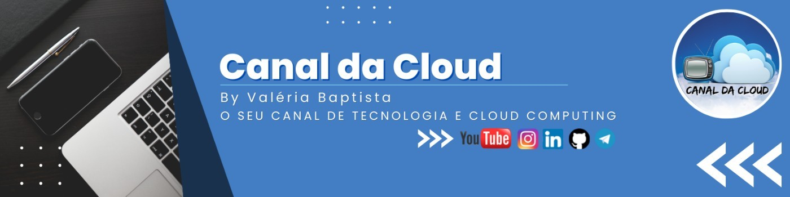

## 💻 **Mentoria de Carreira 2.0 - Canal da Cloud**
### 📅 Data: 23/12/2022

### 🎤 **Palestrantes**

- **Nome:** Antonio Junior
- **Contato:** asilva@unicast.com.br
- **Título:** Azure Kubernetes Services - Fundamentos Básicos

#### **Resumo da apresentação:** 

>Kubernetes (também conhecido como K8s) é uma plataforma de código aberto usada para executar, orquestrar e gerenciar aplicativos e serviços em contêineres em clusters de máquinas físicas ou virtuais em nuvens locais, públicas, privadas e híbridas. 

### 💬 Conteúdo

- 💻 [Slides]() 
- 📹 [Vídeo](https://www.youtube.com/watch?v=y9TlYoa-lZ8)

### 🔗 Links

- [CNCF](https://www.cncf.io/)
- [Kubernetes](https://kubernetes.io/)
- [Azure Kubernetes Services](https://learn.microsoft.com/pt-br/azure/aks/)

