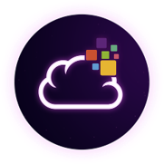

# Code and slides from my presentations

A repository to store and share the code and slides from the various presentations that I've given.

 
  
   
   
   
  
  

    
## :speaker: Presentations

### 2023

- [TDC Connections - Quando (e quando não) utilizar Kubernetes](TDC%20-%20Connections%202023)
- [Mentoria de Carreira (Canal da Cloud) - Treinamento Oficial AZ-305 (EP4)](https://www.youtube.com/watch?v=cougpafMcV4)
- [Mentoria de Carreira (Canal da Cloud) - Treinamento Oficial AZ-104 (EP4)](https://www.youtube.com/watch?v=_OfZiOFokKs)
- [Mentoria de Carreira (Canal da Cloud) - Treinamento Oficial AZ-104 (EP3)](https://www.youtube.com/watch?v=qWhdioh9kw4)
- [Mentoria de Carreira (Canal da Cloud) - Treinamento Oficial AZ-104 (EP2)](https://www.youtube.com/watch?v=8ATiFpwkUhc)
- [Mentoria de Carreira (Canal da Cloud) - Como configuro meu VS Code para DevOps](Como%20configuro%20meu%20VS%20code%20para%20DevOps)

### 2022

- [TDC Connections - Entregando projetos em cloud, Like a Boss!](TDC%20Connections%202022)
- [TDC Future - CAF - Cloud Adoption Framework a bússola do arquiteto Azure](TDC%20Future%202022)
- [Mentoria de Carreira (Canal da Cloud) - A arte em criar topologias profissionais com Microsoft Visio](A%20arte%20em%20criar%20topologias%20profissionais%20com%20Microsoft%20Visio)
- [Mentoria de Carreira (Canal da Cloud) - Azure Kubernetes Services - Fundamentos Básicos](Azure%20Kubernetes%20Services%20-%20Fundamentos%20Básicos)

### 2019

- [XIX Semana da Informática UEMG - Um ISP para chamar de seu!](XIV%20Semana%20da%20Inform%C3%A1tica%20UEMG%202019/README.md)

## :memo: License

This project is under [MIT License](./LICENSE).
