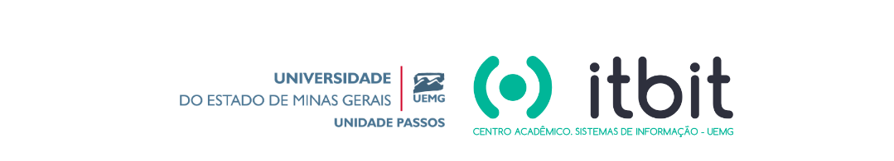

## 💻 **XIX Semana da Informática UEMG**
### 📅 Data: 07/11/2019

### 🎤 **Palestrantes**

- **Nome:** Antonio Junior
- **Contato:** asilva@unicast.com.br
- **Título:** Um ISP para chamar de seu!

#### **Resumo da apresentação:** 

> O Centro Acadêmico Itbit do curso Sistemas de Informação - UEMG Passos tem a satisfação de apresentar a XIX Semana de Informática UEMG-Passos! 
>
>Um ISP para chamar de seu! O que é e como funciona um provedor de acesso.

### 💬 Conteúdo

- 💻 [Slides](/XIV%20Semana%20da%20Inform%C3%A1tica%20UEMG%202019/Um%20ISP%20para%20chamar%20de%20seu.pdf) 